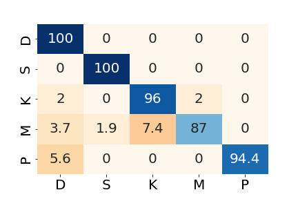
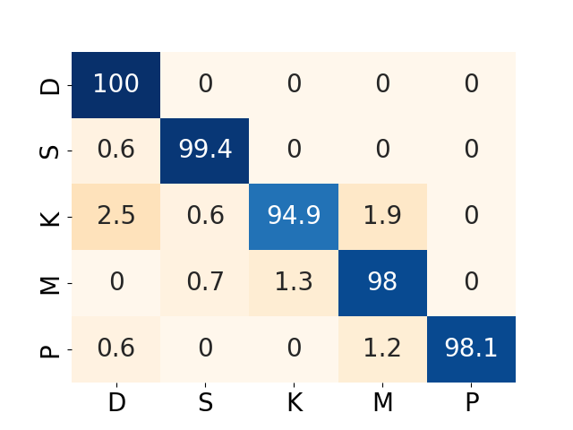

# Cervical cancer cell detection 
by Michele Lunelli

This application classifies whole slide images from PAP smear test or cropped single cells, using
VGG-19 convolutional neural networks topped with a fully-connected layer. There are 5 classes of cells:
- S: Superficial-Intermediate cells (normal)
- P: Parabasal cells (normal)
- K: Koilocytotic cells (abnomal)
- D: Dysketarotic cells (abnormal)
- M: Metaplastic cells (benign)

The accuracy on the validation set (20% of the images) is 94.8% for the whole slide images
and 98.2 % for the single cell images.
Confusion matrices for the whole slide and single cell models:

A Grad-CAM++ map is also generated and can be visualized over the image to identify which parts
are crucial in determining the outcome of the cell type.

Both networks have been trained using the annotated SIPaKMeD dataset:

Marina E. Plissiti, Panagiotis Dimitrakopoulos, Giorgos Sfikas, Christophoros Nikou, Olga Krikoni, Antonia Charchanti, SIPAKMED: A new dataset for feature and image based classification of normal and pathological cervical cells in Pap smear images, IEEE International Conference on Image Processing (ICIP) 2018, Athens, Greece, 7-10 October 2018.

https://www.cs.uoi.gr/~marina/sipakmed.html

The Grad-CAM++ map is generated using the tf-keras-vis library:
https://github.com/keisen/tf-keras-vis

## Usage

The application has a Stremlit interface. Please download some image from the sample_images folder of this repository to test it. It is available here:

https://cancercell.streamlit.app

Or clone the repository and launch streamlit:

streamlit run streamlit_app.py

The two large model files with the trained VGG19 weights have been removed from this repo and are available to download from:

https://drive.google.com/drive/folders/1JVsa0dGJmOjr966ug9oiMR93mkVOY8yA
